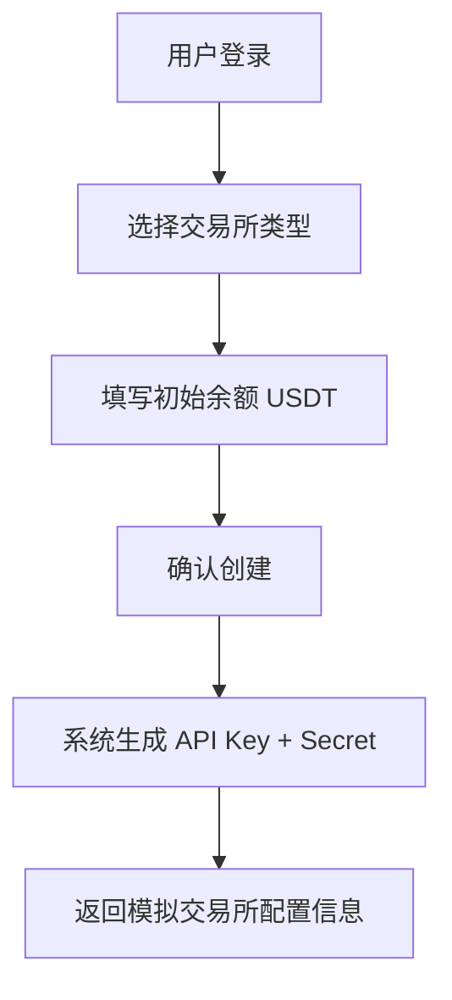
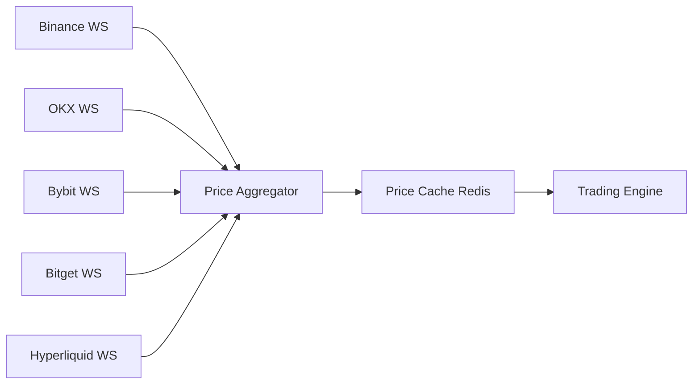
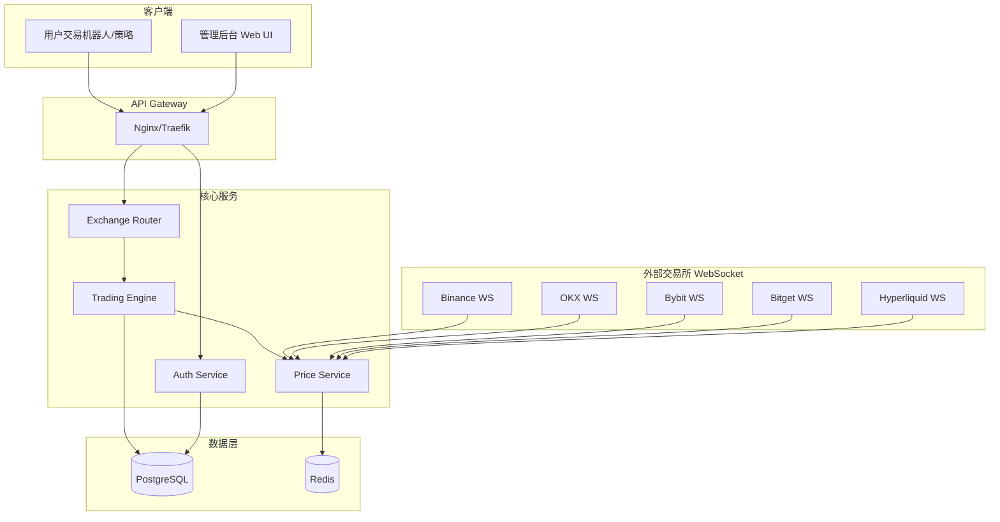
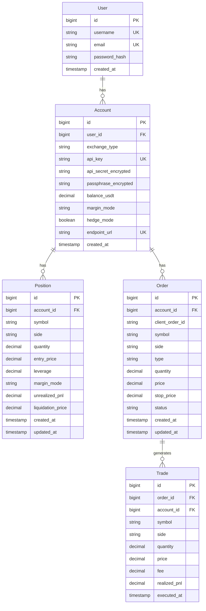

# CCXT Simulator 需求文档

> **版本**: v1.0  
> **日期**: 2025-12-27  
> **作者**: AI Assistant

---

## 1. 项目概述

### 1.1 项目背景

当前各大加密货币交易所提供的模拟交易功能存在一个核心问题：模拟交易价格与实际市场价格存在较大偏差，导致用户无法准确测试其交易策略。这种价格差异使得模拟环境的测试结果无法真实反映实盘交易的表现。

### 1.2 项目目标

构建一个基于真实市场价格的交易模拟器，通过 WebSocket 连接各交易所获取实时价格，提供与真实交易所 API 完全兼容的接口，使用户只需更改 API 端点和密钥即可无缝切换到模拟环境。

### 1.3 技术栈

| 组件 | 技术选型 |
|------|----------|
| 后端语言 | Go 1.21+ |
| Web 框架 | Gin |
| 数据库 | PostgreSQL |
| 缓存 | Redis |
| 实时数据 | WebSocket (各交易所原生WS) |

---

## 2. 支持的交易所

| 交易所 | 优先级 | 备注 |
|--------|--------|------|
| Binance (USDT-M Futures) | P0 | 首批支持 |
| OKX (USDT-M Futures) | P0 | 首批支持 |
| Bybit (USDT Perpetual) | P0 | 首批支持 |
| Bitget (USDT-M Futures) | P1 | 第二批支持 |
| Hyperliquid | P1 | 第二批支持 |

---

## 3. 功能需求

### 3.1 后台管理功能

#### 3.1.1 用户注册

| 字段 | 类型 | 必填 | 说明 |
|------|------|------|------|
| 用户名 | string | 是 | 唯一标识 |
| 邮箱 | string | 是 | 用于验证和找回密码 |
| 密码 | string | 是 | 加密存储 |

#### 3.1.2 用户登录

- 支持用户名/邮箱 + 密码登录
- JWT Token 认证
- Token 刷新机制

#### 3.1.3 交易所账户管理

**创建模拟交易所账户流程：**



**账户属性：**

| 属性 | 说明 |
|------|------|
| exchange_type | 交易所类型 (binance/okx/bybit/bitget/hyperliquid) |
| api_key | 自动生成，格式与原交易所一致 |
| api_secret | 自动生成，格式与原交易所一致 |
| passphrase | 仅 OKX 需要，自动生成 |
| initial_balance | 初始 USDT 余额 |
| endpoint_url | 分配的唯一 API 端点 |

**关键功能：**

- ✅ 用户可创建多个交易所账户
- ✅ 每个账户分配唯一 API 端点 URL
- ✅ 支持随时重置 API 密钥
- ✅ 密钥格式与对应交易所保持一致
- ✅ 支持查看和管理所有账户

---

### 3.2 交易接口功能

#### 3.2.1 接口清单

| 接口名称 | 功能描述 | HTTP Method |
|----------|----------|-------------|
| GetBalance | 获取账户余额 | GET |
| GetPositions | 获取当前持仓 | GET |
| OpenLong | 开多仓 | POST |
| OpenShort | 开空仓 | POST |
| CloseLong | 平多仓 | POST |
| CloseShort | 平空仓 | POST |
| SetLeverage | 设置杠杆 | POST |
| SetMarginMode | 设置保证金模式 (逐仓/全仓) | POST |
| GetMarketPrice | 获取实时市场价格 | GET |
| SetStopLoss | 设置止损 | POST |
| SetTakeProfit | 设置止盈 | POST |
| CancelAllOrders | 取消所有订单 | DELETE |
| GetClosedPnL | 获取已平仓盈亏 | GET |
| GetOrderStatus | 获取订单状态 | GET |

#### 3.2.2 接口兼容性要求

> [!IMPORTANT]
> **核心原则：与原交易所 API 完全兼容**

- **请求格式**：与对应交易所保持完全一致
- **响应格式**：与对应交易所保持完全一致
- **签名验证**：采用与对应交易所相同的签名算法
- **错误码**：复用交易所原有错误码体系

**用户迁移成本：仅需修改以下配置**

```diff
# Binance 示例
- base_url: https://fapi.binance.com
+ base_url: https://sim.yourdomain.com/binance/{account_id}

- api_key: your_real_api_key
+ api_key: your_simulated_api_key

- api_secret: your_real_api_secret
+ api_secret: your_simulated_api_secret
```

---

### 3.3 价格数据功能

#### 3.3.1 WebSocket 价格订阅



**要求：**

- 每个交易所维护独立的 WebSocket 连接
- 订阅热门交易对的实时行情数据
- 支持自动重连机制
- 价格变动实时推送至交易引擎

#### 3.3.2 价格精度

使用各交易所的实际价格精度和数量精度，通过交易所 API 获取：

- 价格精度 (Price Precision)
- 数量精度 (Quantity Precision)
- 最小下单量 (Min Qty)
- 最小下单金额 (Min Notional)

---

### 3.4 交易引擎功能

#### 3.4.1 订单类型支持

| 订单类型 | 说明 |
|----------|------|
| Market Order | 市价单，按当前价格立即成交 |
| Limit Order | 限价单，价格触及时成交 |
| Stop Loss | 止损单 |
| Take Profit | 止盈单 |
| Trailing Stop | 追踪止损（可选） |

#### 3.4.2 交易规则模拟

- **手续费**: 按各交易所实际费率计算
- **杠杆**: 支持 1-125x（根据交易所限制）
- **爆仓**: 根据维持保证金率计算强平价格
- **资金费率**: 模拟资金费率结算（可选）

#### 3.4.3 仓位管理

- 支持单向持仓模式 (One-Way Mode)
- 支持双向持仓模式 (Hedge Mode)
- 逐仓保证金模式 (Isolated Margin)
- 全仓保证金模式 (Cross Margin)

---

## 4. 非功能需求

### 4.1 性能要求

| 指标 | 目标值 |
|------|--------|
| API 响应延迟 | < 100ms (P99) |
| WebSocket 价格延迟 | < 50ms |
| 并发订单处理 | > 1000 TPS |
| 系统可用性 | 99.9% |

### 4.2 安全要求

- API 密钥加密存储
- HTTPS 强制
- Rate Limiting（速率限制）
- IP 白名单（可选）
- 请求签名验证

### 4.3 可观测性

- 结构化日志
- 指标监控 (Prometheus)
- 链路追踪 (OpenTelemetry)
- 告警机制

---

## 5. 系统架构

### 5.1 整体架构



### 5.2 模块划分

| 模块 | 职责 |
|------|------|
| Auth Service | 用户认证、密钥管理 |
| Exchange Router | 交易所路由、API 适配 |
| Trading Engine | 订单撮合、仓位管理 |
| Price Service | 价格聚合、WS 管理 |

---

## 6. API 端点设计

### 6.1 后台管理 API

```
POST   /api/v1/auth/register          # 用户注册
POST   /api/v1/auth/login             # 用户登录
POST   /api/v1/auth/refresh           # Token 刷新

GET    /api/v1/accounts               # 获取所有模拟账户
POST   /api/v1/accounts               # 创建模拟账户
GET    /api/v1/accounts/:id           # 获取账户详情
PUT    /api/v1/accounts/:id           # 更新账户配置
DELETE /api/v1/accounts/:id           # 删除账户
POST   /api/v1/accounts/:id/reset-key # 重置 API 密钥
```

### 6.2 交易所兼容 API

根据交易所类型，API 结构如下：

```
# Binance 兼容端点
/binance/{account_id}/fapi/v1/balance
/binance/{account_id}/fapi/v2/positionRisk
/binance/{account_id}/fapi/v1/order
...

# OKX 兼容端点
/okx/{account_id}/api/v5/account/balance
/okx/{account_id}/api/v5/account/positions
/okx/{account_id}/api/v5/trade/order
...

# Bybit 兼容端点
/bybit/{account_id}/v5/account/wallet-balance
/bybit/{account_id}/v5/position/list
/bybit/{account_id}/v5/order/create
...
```

---

## 7. 数据模型

### 7.1 核心实体



---

## 8. 开发计划

### Phase 1: 基础框架 (Week 1-2)

- [ ] 项目初始化、目录结构
- [ ] 数据库设计与迁移
- [ ] 用户认证模块
- [ ] 账户管理模块

### Phase 2: 价格服务 (Week 3)

- [ ] Binance WebSocket 连接
- [ ] OKX WebSocket 连接
- [ ] Bybit WebSocket 连接
- [ ] 价格聚合与缓存

### Phase 3: 交易引擎 (Week 4-5)

- [ ] 订单创建与管理
- [ ] 仓位管理
- [ ] 盈亏计算
- [ ] 强平逻辑

### Phase 4: 交易所适配 (Week 6-7)

- [ ] Binance API 适配
- [ ] OKX API 适配
- [ ] Bybit API 适配

### Phase 5: 完善与测试 (Week 8)

- [ ] Bitget / Hyperliquid 适配
- [ ] 集成测试
- [ ] 性能优化
- [ ] 文档完善

---

## 9. 风险与挑战

| 风险 | 影响 | 缓解措施 |
|------|------|----------|
| 交易所 API 变更 | 兼容性破坏 | 版本化 API、持续监控变更 |
| WebSocket 连接不稳定 | 价格延迟 | 自动重连、多节点部署 |
| 高并发订单 | 性能瓶颈 | 优化算法、水平扩展 |
| 价格同步延迟 | 模拟不准确 | 使用高性能消息队列 |

---

## 10. 附录

### 10.1 各交易所 API 文档

- [Binance Futures API](https://binance-docs.github.io/apidocs/futures/en/)
- [OKX API](https://www.okx.com/docs-v5/)
- [Bybit V5 API](https://bybit-exchange.github.io/docs/v5/intro)
- [Bitget API](https://www.bitget.com/api-doc/)
- [Hyperliquid API](https://hyperliquid.gitbook.io/hyperliquid-docs/)

### 10.2 术语表

| 术语 | 说明 |
|------|------|
| USDT-M | USDT 保证金合约 |
| Perpetual | 永续合约 |
| Cross Margin | 全仓保证金 |
| Isolated Margin | 逐仓保证金 |
| Hedge Mode | 双向持仓模式 |
| One-Way Mode | 单向持仓模式 |
| Liquidation | 强制平仓 |
| PnL | 盈亏 (Profit and Loss) |
