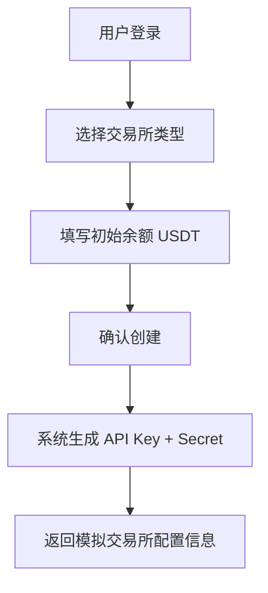
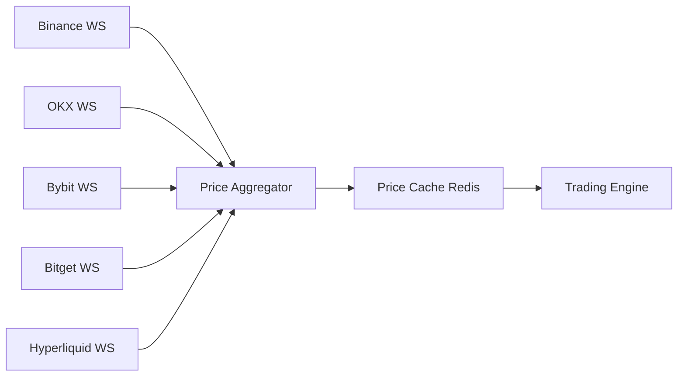
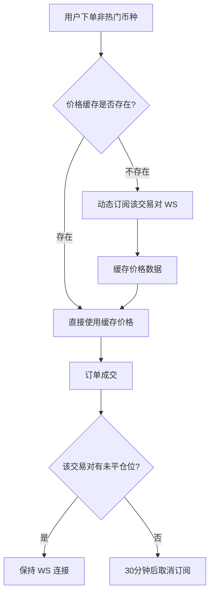
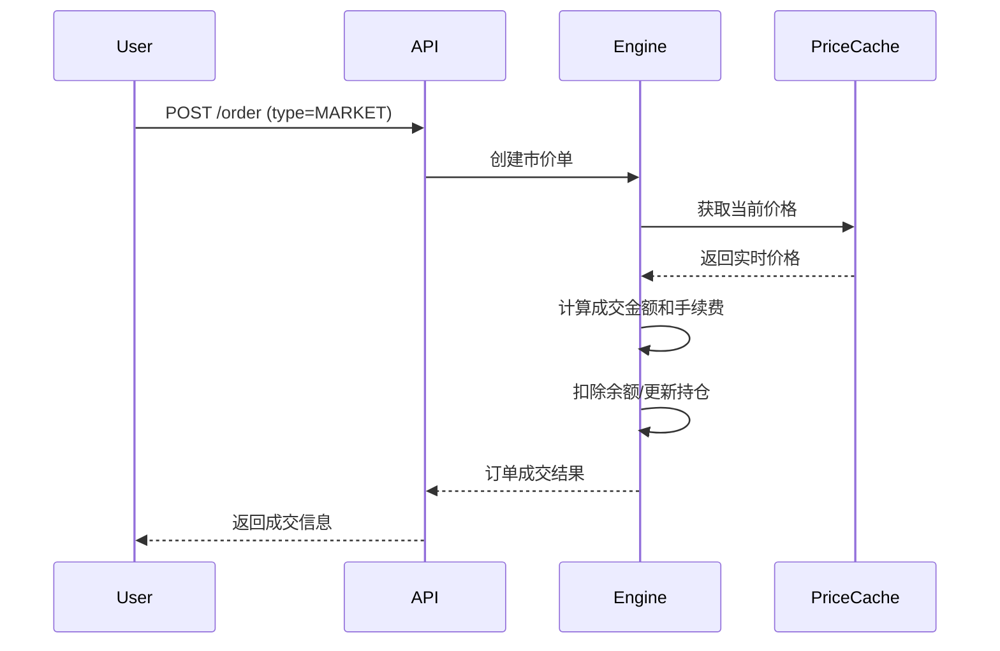
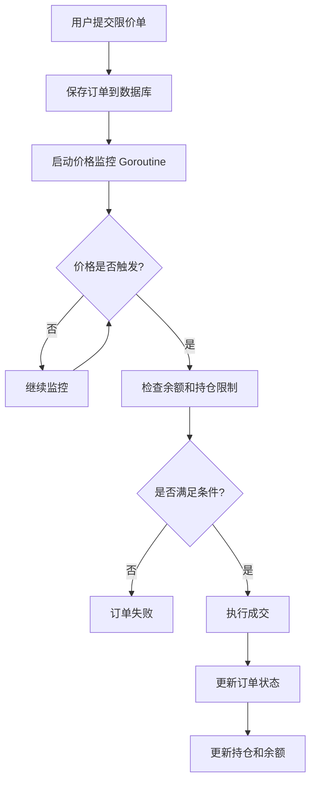
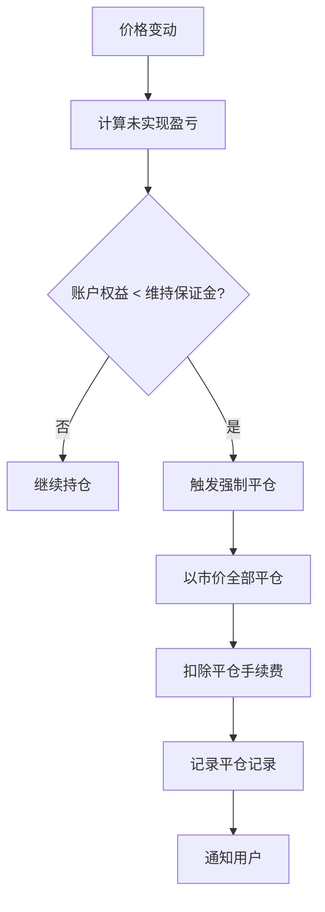
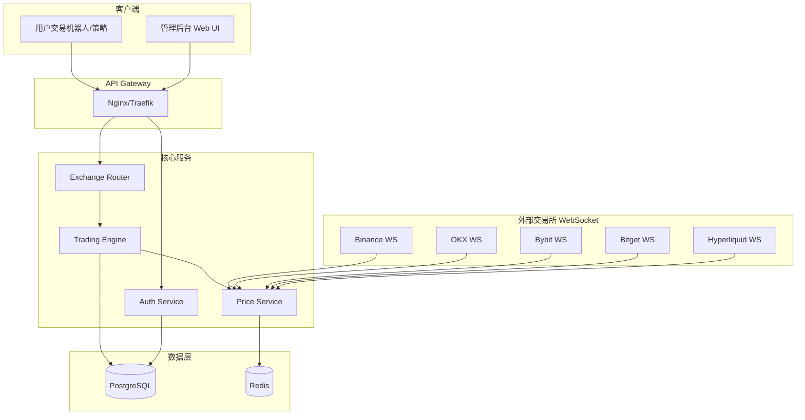
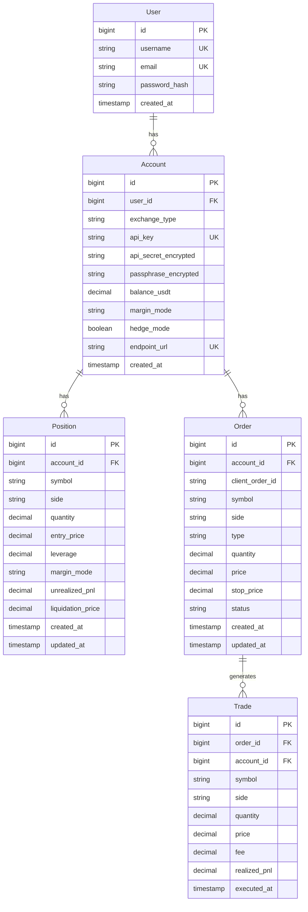

# CCXT Simulator 需求文档

> **版本**: v1.0  
> **日期**: 2025-12-27  
> **作者**: AI Assistant

---

## 1. 项目概述

### 1.1 项目背景

当前各大加密货币交易所提供的模拟交易功能存在一个核心问题：模拟交易价格与实际市场价格存在较大偏差，导致用户无法准确测试其交易策略。这种价格差异使得模拟环境的测试结果无法真实反映实盘交易的表现。

### 1.2 项目目标

构建一个基于真实市场价格的交易模拟器，通过 WebSocket 连接各交易所获取实时价格，提供与真实交易所 API 完全兼容的接口，使用户只需更改 API 端点和密钥即可无缝切换到模拟环境。

### 1.3 技术栈

| 组件 | 技术选型 |
|------|----------|
| 后端语言 | Go 1.21+ |
| Web 框架 | Gin |
| 数据库 | PostgreSQL |
| 缓存 | Redis |
| 实时数据 | WebSocket (各交易所原生WS) |
| 前端界面 | Vue 3 + Element Plus (可选) |

### 1.4 技术选型说明

#### 1.4.1 交易所 SDK 选择

本项目**采用各交易所原生 Go SDK**，而非使用 CCXT 统一封装库。

**选择原生 SDK 的原因：**

| 对比维度 | 原生 Go SDK | CCXT (go-ccxt) |
|---------|------------|----------------|
| 性能 | ✅ 原生 Go 实现，性能最优 | ❌ 非官方移植，性能较差 |
| 官方支持 | ✅ 交易所官方维护 | ❌ 社区维护，更新滞后 |
| 功能完整性 | ✅ 支持所有 API 功能 | ⚠️ 部分功能缺失 |
| 类型安全 | ✅ 强类型支持 | ⚠️ 类型定义不完整 |
| 更新速度 | ✅ 与交易所 API 同步更新 | ❌ 通常延迟 1-3 个月 |

**推荐的 SDK 清单：**

```go
// Binance
import "github.com/adshao/go-binance/v2/futures"

// OKX
import "github.com/amir-the-h/okex"

// Bybit
import "github.com/wuhewuhe/bybit.go.api"

// Bitget - 自行封装 HTTP 客户端
// Hyperliquid - 自行封装 HTTP 客户端
```

**对于 Bitget 和 Hyperliquid**，由于缺少成熟的 Go SDK，我们将：
1. 使用 `net/http` 标准库直接调用 REST API
2. 使用 `gorilla/websocket` 处理 WebSocket 连接
3. 参考官方文档实现签名算法

#### 1.4.2 管理后台前端

**是否开发前端界面？** 是，提供基础的管理后台。

**技术栈：**
- **框架**: Vue 3 (Composition API)
- **UI 组件库**: Element Plus
- **状态管理**: Pinia
- **HTTP 客户端**: Axios
- **构建工具**: Vite

**前端功能范围：**
- ✅ 用户注册/登录
- ✅ 创建/管理模拟交易所账户
- ✅ 查看账户余额、持仓、订单
- ✅ 重置 API 密钥
- ❌ 不提供交易下单界面（用户通过 API 交易）

> [!NOTE]
> 前端为可选组件，用户也可以直接通过 REST API 管理账户。

---

## 2. 支持的交易所

| 交易所 | 优先级 | 备注 |
|--------|--------|------|
| Binance (USDT-M Futures) | P0 | 首批支持 |
| OKX (USDT-M Futures) | P0 | 首批支持 |
| Bybit (USDT Perpetual) | P0 | 首批支持 |
| Bitget (USDT-M Futures) | P1 | 第二批支持 |
| Hyperliquid | P1 | 第二批支持 |

---

## 3. 功能需求

### 3.1 后台管理功能

#### 3.1.1 用户注册

| 字段 | 类型 | 必填 | 说明 |
|------|------|------|------|
| 用户名 | string | 是 | 唯一标识 |
| 邮箱 | string | 是 | 用于验证和找回密码 |
| 密码 | string | 是 | 加密存储 |

#### 3.1.2 用户登录

- 支持用户名/邮箱 + 密码登录
- JWT Token 认证
- Token 刷新机制

#### 3.1.3 交易所账户管理

**创建模拟交易所账户流程：**



**账户属性：**

| 属性 | 说明 |
|------|------|
| exchange_type | 交易所类型 (binance/okx/bybit/bitget/hyperliquid) |
| api_key | 自动生成，格式与原交易所一致 |
| api_secret | 自动生成，格式与原交易所一致 |
| passphrase | 仅 OKX 需要，自动生成 |
| initial_balance | 初始 USDT 余额 |
| endpoint_url | 分配的唯一 API 端点 |

**关键功能：**

- ✅ 用户可创建多个交易所账户
- ✅ 每个账户分配唯一 API 端点 URL
- ✅ 支持随时重置 API 密钥
- ✅ 密钥格式与对应交易所保持一致
- ✅ 支持查看和管理所有账户

---

### 3.2 交易接口功能

#### 3.2.1 接口清单

| 接口名称 | 功能描述 | HTTP Method |
|----------|----------|-------------|
| GetBalance | 获取账户余额 | GET |
| GetPositions | 获取当前持仓 | GET |
| OpenLong | 开多仓 | POST |
| OpenShort | 开空仓 | POST |
| CloseLong | 平多仓 | POST |
| CloseShort | 平空仓 | POST |
| SetLeverage | 设置杠杆 | POST |
| SetMarginMode | 设置保证金模式 (逐仓/全仓) | POST |
| GetMarketPrice | 获取实时市场价格 | GET |
| SetStopLoss | 设置止损 | POST |
| SetTakeProfit | 设置止盈 | POST |
| CancelAllOrders | 取消所有订单 | DELETE |
| GetClosedPnL | 获取已平仓盈亏 | GET |
| GetOrderStatus | 获取订单状态 | GET |

#### 3.2.2 接口兼容性要求

> [!IMPORTANT]
> **核心原则：与原交易所 API 完全兼容**

- **请求格式**：与对应交易所保持完全一致
- **响应格式**：与对应交易所保持完全一致
- **签名验证**：采用与对应交易所相同的签名算法
- **错误码**：复用交易所原有错误码体系

**用户迁移成本：仅需修改以下配置**

```diff
# Binance 示例
- base_url: https://fapi.binance.com
+ base_url: https://sim-binance.yourdomain.com

- api_key: your_real_api_key
+ api_key: your_simulated_api_key

- api_secret: your_real_api_secret
+ api_secret: your_simulated_api_secret
```

> [!TIP]
> **优化设计**：每个交易所账户使用独立的子域名，通过 API Key 识别账户，用户无需修改 API 路径。

#### 3.2.3 接口适配策略

本项目提供**两套 API 体系**：

##### 1. 简化 API（高级封装）

提供语义化的交易接口，简化用户开发：

```go
// 伪代码示例
POST /api/v1/trade/open-long     // 开多仓
POST /api/v1/trade/open-short    // 开空仓
POST /api/v1/trade/close-long    // 平多仓
POST /api/v1/trade/close-short   // 平空仓
```

**请求参数（统一格式）：**

```json
{
  "symbol": "BTCUSDT",
  "quantity": 0.01,
  "price": 50000,  // 可选，不填则市价
  "leverage": 10,
  "stop_loss": 48000,  // 可选
  "take_profit": 52000  // 可选
}
```

##### 2. 兼容 API（完全模拟交易所）

完全复刻各交易所的原生 API，实现无缝迁移：

**Binance 适配映射：**

| 原交易所接口 | 模拟器接口 | 说明 |
|-------------|-----------|------|
| `POST /fapi/v1/order` | `POST /fapi/v1/order` | 创建订单 |
| `GET /fapi/v2/balance` | `GET /fapi/v2/balance` | 获取余额 |
| `GET /fapi/v2/positionRisk` | `GET /fapi/v2/positionRisk` | 获取持仓 |
| `DELETE /fapi/v1/allOpenOrders` | `DELETE /fapi/v1/allOpenOrders` | 取消所有订单 |

**OKX 适配映射：**

| 原交易所接口 | 模拟器接口 | 说明 |
|-------------|-----------|------|
| `POST /api/v5/trade/order` | `POST /api/v5/trade/order` | 下单 |
| `GET /api/v5/account/balance` | `GET /api/v5/account/balance` | 获取余额 |
| `GET /api/v5/account/positions` | `GET /api/v5/account/positions` | 获取持仓 |

**Bybit 适配映射：**

| 原交易所接口 | 模拟器接口 | 说明 |
|-------------|-----------|------|
| `POST /v5/order/create` | `POST /v5/order/create` | 创建订单 |
| `GET /v5/account/wallet-balance` | `GET /v5/account/wallet-balance` | 获取余额 |
| `GET /v5/position/list` | `GET /v5/position/list` | 获取持仓 |

**高级封装到原生 API 的映射逻辑：**

```go
// 示例：OpenLong 转换为 Binance 订单参数
func (s *BinanceAdapter) OpenLong(req OpenLongRequest) {
    order := binance.CreateOrderRequest{
        Symbol:       req.Symbol,
        Side:         "BUY",
        PositionSide: "LONG",  // 双向持仓模式
        Type:         determineOrderType(req.Price),
        Quantity:     req.Quantity,
        Price:        req.Price,
    }
    // ...
}
```

---

### 3.3 价格数据功能

#### 3.3.1 WebSocket 价格订阅



**要求：**

- 每个交易所维护独立的 WebSocket 连接
- 订阅热门交易对的实时行情数据
- 支持自动重连机制
- 价格变动实时推送至交易引擎

#### 3.3.2 价格精度

使用各交易所的实际价格精度和数量精度，通过交易所 API 获取：

- 价格精度 (Price Precision)
- 数量精度 (Quantity Precision)
- 最小下单量 (Min Qty)
- 最小下单金额 (Min Notional)

#### 3.3.3 WebSocket 订阅策略

**默认订阅交易对：**

按需订阅，而非全量订阅。系统维护一个热门交易对列表：

```go
var DefaultSymbols = []string{
    "BTCUSDT", "ETHUSDT", "BNBUSDT", "SOLUSDT",
    "XRPUSDT", "ADAUSDT", "DOGEUSDT", "AVAXUSDT",
    // ... 约 50 个主流币种
}
```

**动态订阅机制：**



**冷门交易对价格获取：**

1. **首次使用**：通过 REST API 获取实时价格
2. **建立连接**：动态订阅该交易对的 WebSocket
3. **自动清理**：无持仓且 30 分钟无交易活动后取消订阅

**连接管理：**

- 每个交易所维护一个 WebSocket 连接池
- 单个连接最多订阅 200 个交易对
- 超过限制时建立新连接
- 自动重连机制（指数退避策略）

---

### 3.4 密钥管理

#### 3.4.1 API 密钥生成规则

为了保证与原交易所的兼容性，生成的 API Key 和 Secret 需遵循各交易所的格式规范：

| 交易所 | API Key 格式 | API Secret 格式 | Passphrase |
|--------|-------------|----------------|------------|
| Binance | 64 字符 (A-Za-z0-9) | 64 字符 (A-Za-z0-9) | 不需要 |
| OKX | 36 字符 UUID (带短横线) | 32 字符 Base64 | 8-32 字符 |
| Bybit | 20 字符 (大写字母+数字) | 40 字符 (小写十六进制) | 不需要 |
| Bitget | 32 字符 (小写字母+数字) | 64 字符 (小写字母+数字) | 不需要 |
| Hyperliquid | 42 字符以太坊地址 (0x 开头) | 64 字符私钥 (十六进制) | 不需要 |

**生成示例代码：**

```go
func GenerateAPIKey(exchange string) (apiKey, apiSecret, passphrase string) {
    switch exchange {
    case "binance":
        apiKey = randomAlphaNumeric(64)
        apiSecret = randomAlphaNumeric(64)
    case "okx":
        apiKey = uuid.New().String()
        apiSecret = base64.StdEncoding.EncodeToString(randomBytes(24))
        passphrase = randomAlphaNumeric(16)
    case "bybit":
        apiKey = randomUpperAlphaNumeric(20)
        apiSecret = hex.EncodeToString(randomBytes(20))
    // ...
    }
    return
}
```

#### 3.4.2 签名验证实现

**Binance 签名算法：**

```go
func VerifyBinanceSignature(query, signature, secret string) bool {
    mac := hmac.New(sha256.New, []byte(secret))
    mac.Write([]byte(query))
    expectedSignature := hex.EncodeToString(mac.Sum(nil))
    return signature == expectedSignature
}
```

**OKX 签名算法：**

```go
func VerifyOKXSignature(timestamp, method, path, body, signature, secret string) bool {
    message := timestamp + method + path + body
    mac := hmac.New(sha256.New, []byte(secret))
    mac.Write([]byte(message))
    expectedSignature := base64.StdEncoding.EncodeToString(mac.Sum(nil))
    return signature == expectedSignature
}
```

**Bybit 签名算法：**

```go
func VerifyBybitSignature(params, signature, secret string) bool {
    mac := hmac.New(sha256.New, []byte(secret))
    mac.Write([]byte(params))
    expectedSignature := hex.EncodeToString(mac.Sum(nil))
    return signature == expectedSignature
}
```

### 3.5 交易引擎功能

#### 3.5.1 订单类型支持

| 订单类型 | 说明 |
|----------|------|
| Market Order | 市价单，按当前价格立即成交 |
| Limit Order | 限价单，价格触及时成交 |
| Stop Loss | 止损单 |
| Take Profit | 止盈单 |
| Trailing Stop | 追踪止损（可选） |

#### 3.5.2 交易规则模拟

- **手续费**: 按各交易所实际费率计算
- **杠杆**: 支持 1-125x（根据交易所限制）
- **爆仓**: 根据维持保证金率计算强平价格
- **资金费率**: 模拟资金费率结算（可选）

#### 3.5.3 仓位管理

- 支持单向持仓模式 (One-Way Mode)
- 支持双向持仓模式 (Hedge Mode)
- 逐仓保证金模式 (Isolated Margin)
- 全仓保证金模式 (Cross Margin)

#### 3.5.4 交易执行逻辑

本节详细说明各类订单的执行机制。

##### 市价单执行



**执行规则：**

1. **价格确定**：使用 Redis 缓存中的最新价格（延迟 < 50ms）
2. **滑点模拟**：随机添加 0.01%-0.03% 的滑点
3. **立即成交**：市价单无条件立即成交
4. **手续费计算**：`fee = quantity * price * feeRate`

##### 限价单执行



**执行规则：**

- **买入限价单**：当市场价 ≤ 限价时成交
- **卖出限价单**：当市场价 ≥ 限价时成交
- **监控机制**：使用 Redis Pub/Sub，价格变动时触发检查
- **并发控制**：使用分布式锁防止重复成交

##### 止损/止盈单执行

**触发逻辑：**

```go
// 多仓止损触发：市场价 <= 止损价
if position.Side == "LONG" && marketPrice <= stopLoss {
    executeStopLoss(position)
}

// 多仓止盈触发：市场价 >= 止盈价
if position.Side == "LONG" && marketPrice >= takeProfit {
    executeTakeProfit(position)
}

// 空仓反向逻辑
if position.Side == "SHORT" && marketPrice >= stopLoss {
    executeStopLoss(position)
}

if position.Side == "SHORT" && marketPrice <= takeProfit {
    executeTakeProfit(position)
}
```

**监控机制：**

1. **实时监控**：每个持有 SL/TP 的仓位启动一个 Goroutine
2. **价格订阅**：订阅对应交易对的 WebSocket 价格推送
3. **触发执行**：价格满足条件时立即以市价平仓
4. **资源清理**：仓位平仓后自动停止监控

##### 强制平仓（爆仓）逻辑

**强平价格计算：**

```go
// 多仓强平价格
liquidationPrice = entryPrice * (1 - 1/leverage + maintenanceMarginRate)

// 空仓强平价格
liquidationPrice = entryPrice * (1 + 1/leverage - maintenanceMarginRate)
```

**维持保证金率（参考 Binance）：**

| 仓位价值 (USDT) | 维持保证金率 |
|----------------|-------------|
| 0 - 50,000 | 0.4% |
| 50,000 - 250,000 | 0.5% |
| 250,000 - 1,000,000 | 1.0% |
| > 1,000,000 | 2.5% |

**强平执行：**



---

## 4. 非功能需求

### 4.1 性能要求

| 指标 | 目标值 |
|------|--------|
| API 响应延迟 | < 100ms (P99) |
| WebSocket 价格延迟 | < 50ms |
| 并发订单处理 | > 1000 TPS |
| 系统可用性 | 99.9% |

### 4.2 安全要求

- API 密钥加密存储
- HTTPS 强制
- Rate Limiting（速率限制）
- IP 白名单（可选）
- 请求签名验证

### 4.3 可观测性

- 结构化日志
- 指标监控 (Prometheus)
- 链路追踪 (OpenTelemetry)
- 告警机制

### 4.4 错误处理

#### 4.4.1 边界情况处理

| 场景 | 错误码 | 处理策略 |
|------|--------|----------|
| 余额不足 | `-2019` | 拒绝订单，返回 `Insufficient balance` |
| 杠杆超限 | `-4061` | 拒绝订单，返回允许的最大杠杆 |
| 数量精度错误 | `-1111` | 拒绝订单，返回精度要求 |
| 最小下单量不足 | `-1013` | 拒绝订单，返回最小下单量 |
| 持仓模式冲突 | `-4059` | 拒绝订单，提示切换持仓模式 |
| 交易对不存在 | `-1121` | 拒绝订单，返回支持的交易对列表 |
| API 签名错误 | `-1022` | 拒绝请求，返回签名示例 |
| API 密钥无效 | `-2015` | 拒绝请求，提示检查密钥 |
| WebSocket 断线 | - | 自动重连，断线期间使用 REST API |
| 价格数据延迟 | - | 超过 5 秒未更新则拒绝市价单 |

> [!WARNING]
> 所有错误码必须与对应交易所的错误码保持一致，确保客户端兼容性。

#### 4.4.2 Binance 错误码映射

```go
var BinanceErrorCodes = map[string]int{
    "insufficient_balance": -2019,
    "invalid_leverage": -4061,
    "invalid_quantity": -1111,
    "min_notional": -1013,
    "position_side_not_match": -4059,
    "invalid_symbol": -1121,
    "invalid_signature": -1022,
    "invalid_api_key": -2015,
}
```

#### 4.4.3 异常恢复机制

**WebSocket 断线处理：**

```go
func (ws *WebSocketClient) maintainConnection() {
    for {
        err := ws.connect()
        if err != nil {
            backoff := calculateBackoff(ws.retryCount)
            log.Warn("WebSocket disconnected, retrying", 
                "exchange", ws.exchange,
                "retry_after", backoff)
            time.Sleep(backoff)
            ws.retryCount++
            continue
        }
        ws.retryCount = 0
        ws.handleMessages() // 阻塞直到断线
    }
}

// 指数退避策略
func calculateBackoff(retryCount int) time.Duration {
    backoff := time.Second * time.Duration(math.Pow(2, float64(retryCount)))
    if backoff > 60*time.Second {
        backoff = 60 * time.Second
    }
    return backoff
}
```

**数据库事务失败处理：**

```go
func (s *TradingService) ExecuteOrder(ctx context.Context, order *Order) error {
    return s.db.Transaction(func(tx *gorm.DB) error {
        // 1. 锁定账户余额
        if err := tx.Clauses(clause.Locking{Strength: "UPDATE"}).First(&account).Error; err != nil {
            return err
        }
        
        // 2. 检查余额
        if account.Balance < order.RequiredMargin {
            return ErrInsufficientBalance
        }
        
        // 3. 扣除余额
        account.Balance -= order.RequiredMargin
        if err := tx.Save(&account).Error; err != nil {
            return err // 自动回滚
        }
        
        // 4. 创建持仓
        if err := tx.Create(&position).Error; err != nil {
            return err // 自动回滚
        }
        
        return nil
    })
}
```

**Redis 缓存失效处理：**

```go
func (s *PriceService) GetPrice(symbol string) (float64, error) {
    // 1. 尝试从 Redis 获取
    price, err := s.redis.Get(ctx, "price:"+symbol).Float64()
    if err == nil {
        return price, nil
    }
    
    // 2. Redis 失效，降级到内存缓存
    if price, ok := s.memCache.Get(symbol); ok {
        log.Warn("Redis unavailable, using memory cache")
        return price.(float64), nil
    }
    
    // 3. 内存缓存也没有，调用 REST API
    price, err = s.fetchPriceFromExchange(symbol)
    if err != nil {
        return 0, fmt.Errorf("all price sources failed: %w", err)
    }
    
    return price, nil
}
```

---

## 5. 系统架构

### 5.1 整体架构



### 5.2 模块划分

| 模块 | 职责 |
|------|------|
| Auth Service | 用户认证、密钥管理 |
| Exchange Router | 交易所路由、API 适配 |
| Trading Engine | 订单撮合、仓位管理 |
| Price Service | 价格聚合、WS 管理 |

---

## 6. API 端点设计

### 6.1 后台管理 API

```
POST   /api/v1/auth/register          # 用户注册
POST   /api/v1/auth/login             # 用户登录
POST   /api/v1/auth/refresh           # Token 刷新

GET    /api/v1/accounts               # 获取所有模拟账户
POST   /api/v1/accounts               # 创建模拟账户
GET    /api/v1/accounts/:id           # 获取账户详情
PUT    /api/v1/accounts/:id           # 更新账户配置
DELETE /api/v1/accounts/:id           # 删除账户
POST   /api/v1/accounts/:id/reset-key # 重置 API 密钥
```

### 6.2 交易所兼容 API

**设计方案：通过子域名区分交易所，通过 API Key 识别账户**

每个用户创建模拟账户时，系统分配一个专属子域名：

```
https://sim-binance.yourdomain.com    # Binance 模拟端点
https://sim-okx.yourdomain.com        # OKX 模拟端点
https://sim-bybit.yourdomain.com      # Bybit 模拟端点
https://sim-bitget.yourdomain.com     # Bitget 模拟端点
https://sim-hyperliquid.yourdomain.com # Hyperliquid 模拟端点
```

**API 路径保持与原交易所完全一致：**

```
# Binance 兼容端点
GET  https://sim-binance.yourdomain.com/fapi/v2/balance
GET  https://sim-binance.yourdomain.com/fapi/v2/positionRisk
POST https://sim-binance.yourdomain.com/fapi/v1/order
DELETE https://sim-binance.yourdomain.com/fapi/v1/allOpenOrders

# OKX 兼容端点
GET  https://sim-okx.yourdomain.com/api/v5/account/balance
GET  https://sim-okx.yourdomain.com/api/v5/account/positions
POST https://sim-okx.yourdomain.com/api/v5/trade/order

# Bybit 兼容端点
GET  https://sim-bybit.yourdomain.com/v5/account/wallet-balance
GET  https://sim-bybit.yourdomain.com/v5/position/list
POST https://sim-bybit.yourdomain.com/v5/order/create
```

**账户识别机制：**

通过请求头中的 `X-MBX-APIKEY` (Binance) 或类似字段识别用户账户：

```go
func (h *Handler) IdentifyAccount(c *gin.Context) (*Account, error) {
    var apiKey string
    
    // 根据交易所类型提取 API Key
    switch h.exchange {
    case "binance":
        apiKey = c.GetHeader("X-MBX-APIKEY")
    case "okx":
        apiKey = c.GetHeader("OK-ACCESS-KEY")
    case "bybit":
        apiKey = c.GetHeader("X-BAPI-API-KEY")
    }
    
    // 根据 API Key 查询账户
    account, err := h.db.GetAccountByAPIKey(apiKey)
    if err != nil {
        return nil, ErrInvalidAPIKey
    }
    
    return account, nil
}
```

**优势：**

✅ 用户仅需修改域名，无需修改 API 路径  
✅ 支持多账户管理（不同 API Key）  
✅ 完全兼容现有交易机器人代码  
✅ 符合各交易所的原生使用习惯

---

## 7. 数据模型

### 7.1 核心实体



---

## 8. 开发计划

### Phase 1: 基础框架 ✅ (已完成)

- [x] 项目初始化、目录结构
- [x] 数据库设计与迁移
- [x] 用户认证模块
- [x] 账户管理模块

### Phase 2: 价格服务 ✅ (已完成)

- [x] Binance WebSocket 连接 (654 交易对)
- [x] OKX WebSocket 连接 (270 交易对)
- [x] Bybit WebSocket 连接 (500 交易对)
- [x] 价格聚合与 Redis 缓存

### Phase 3: 交易引擎 ✅ (已完成)

- [x] 订单创建与管理
- [x] 仓位管理
- [x] 盈亏计算
- [x] 爆仓价格计算
- [x] 14 个交易 API 端点

### Phase 4: 交易所适配 ✅ (已完成)

- [x] Binance API 适配 (/fapi/v1/*, /fapi/v2/*)
- [x] OKX API 适配 (/api/v5/*)
- [x] Bybit API 适配 (/v5/*)
- [x] 签名验证中间件 (HMAC-SHA256)

### Phase 5: 扩展交易所 ✅ (已完成)

- [x] Bitget WebSocket + API 适配 (/api/v2/mix/*)
- [x] Hyperliquid WebSocket + API 适配 (/info, /exchange)
- [x] 完整文档

---

## 系统现状

> **更新时间**: 2025-12-27

| 指标 | 数值 |
|------|------|
| 支持交易所 | 5 (Binance, OKX, Bybit, Bitget, Hyperliquid) |
| Go 源文件 | 40+ |
| API 端点 | 60+ |
| 交易对总数 | 1424+ |
| WebSocket 连接 | 5 (每交易所 1 个) |

---

## 9. 风险与挑战

| 风险 | 影响 | 缓解措施 |
|------|------|----------|
| 交易所 API 变更 | 兼容性破坏 | 版本化 API、持续监控变更 |
| WebSocket 连接不稳定 | 价格延迟 | 自动重连、多节点部署 |
| 高并发订单 | 性能瓶颈 | 优化算法、水平扩展 |
| 价格同步延迟 | 模拟不准确 | 使用高性能消息队列 |

---

## 10. 附录

### 10.1 各交易所 API 文档

- [Binance Futures API](https://binance-docs.github.io/apidocs/futures/en/)
- [OKX API](https://www.okx.com/docs-v5/)
- [Bybit V5 API](https://bybit-exchange.github.io/docs/v5/intro)
- [Bitget API](https://www.bitget.com/api-doc/)
- [Hyperliquid API](https://hyperliquid.gitbook.io/hyperliquid-docs/)

### 10.2 术语表

| 术语 | 说明 |
|------|------|
| USDT-M | USDT 保证金合约 |
| Perpetual | 永续合约 |
| Cross Margin | 全仓保证金 |
| Isolated Margin | 逐仓保证金 |
| Hedge Mode | 双向持仓模式 |
| One-Way Mode | 单向持仓模式 |
| Liquidation | 强制平仓 |
| PnL | 盈亏 (Profit and Loss) |
